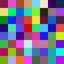
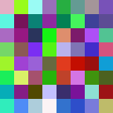

# Hash Noise
Generates a "random" image based on the sha256 hash of an input text.

## Usage

```
$ ./main.py -h
usage: main.py [-h] [-a] [-s] [--width WIDTH] [--height HEIGHT] [TEXT]

positional arguments:
  TEXT             input text for hashing

optional arguments:
  -h, --help       show this help message and exit
  -a, --alpha      generates image with alpha channel
  -s, --show       diplays the image
  --width WIDTH    image width (default = 128, use multiples of 8 for best
                   results)
  --height HEIGHT  image height (default = 128, use multiples of 8 for best
                   results)
```

## Examples

 

Output for text: "virtuaCode"


 

Output for text: ""
